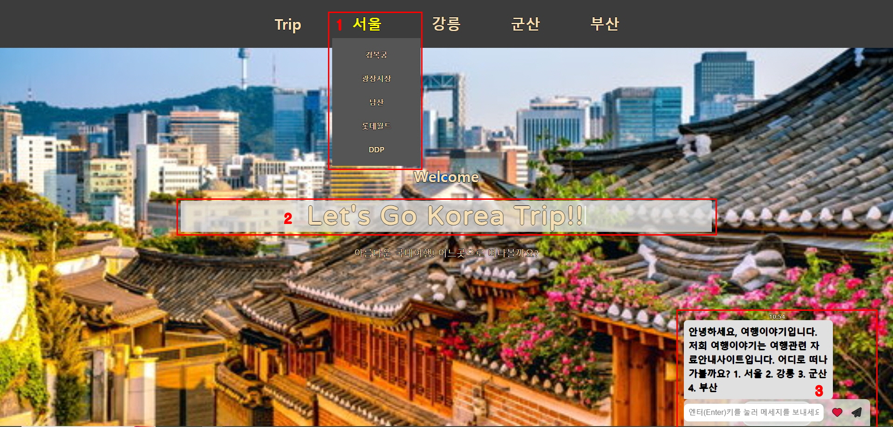
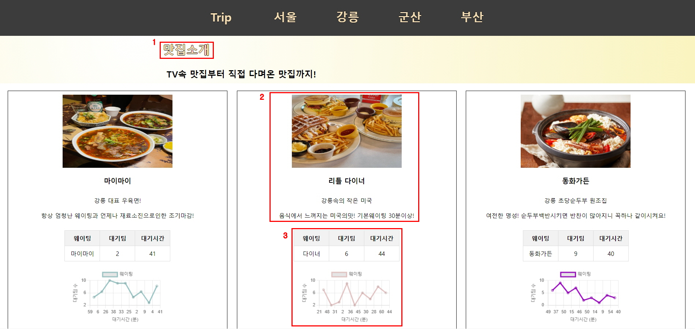

#TeamProject
## 1팀

### 팀원 강연배, 배호진, 이은진, 장준희

> 프로젝트 개요  
   
23년 12월 21일 첫수업을 시작으로 약 3주동안 배운


 를 활용하여
5일이라는 시간안에 사용자에게 편리함을 제공하는 페이지 제작하는 프로젝트를 진행하였습니다.  

저희팀은 "여행" 이라는 주제의 페이지를 제작하였으며,
각 조원별로 원하는 지역을 맡아 각자의 페이지를 제작하였습니다.

***

### 장준희 담당업무
#### 서울
- 서울 메인
- 경복궁
- 광장시장
- 남산
- 롯데월드
- DDP
***
### 주요기능
- 서울 메인에 슬라이드로 야경이미지 제공
- 페이지별 입장금액 혹은 휴무일등 기재
- [더보기] 기능을통해 페이지별 주변 숙소 및 맛집의 평균금액과 평점 제공
- 오시는길(버스,지하철,케이블카 등) 기재
- 자세한내용은 하이퍼링크로 네이버와 연결
***
### 향후과제
- 메인페이지 외관 보정
- 메인페이지 날씨 실시간으로 변경
- 메인페이지 지도의 랜드마크 클릭시 해당페이지로 이동
- 페이지별 메인이미지를 슬라이드로 변경하여 많은 이미지 제공
- 페이지별 주변 숙소및 맛집 금액및 평점 혹은 이용자 실시간 제공
- 회원가입,로그인을 통해 서버 관련 구축
- 챗봇기능 업그레이드
***
### 강연배 담당업무
> 메인페이지와 강릉 지역을 맡아 제작하였습니다.
#### 메인페이지


  

  
| 슬라이드 네비게이션 바 제작 | 계속하여 바뀌는 글자들 | 챗봇 |
|-----------------------------|-----------------------|-------|
| 마우스를 가져가면 내려오는 네비게이션바.  | 첫 페이지인만큼 사용자의 눈길을 사로잡기위한 글자 퍼포먼스 | Chat us! 라는 버튼을 클릭하면 챗봇이 나타남.  |
| 선택하고있는 곳의 글자 색상이 변합니다.  | JQ를 이용하여 도전해봄  | 사용자의 다양한 질문에 답변가능  |

```
향후 메인페이지의 배경이미지또한 페이드인,아웃으로 변동되도록 수정 예정입니다.
```
***
#### 강릉


| 움직이는글자 | 링크이동 | 그래프 |
|-------------|---------|-------|
| "맛집소개" 라는 글자는 계속하여 위아래로 움직입니다  | - 그림 또는 설명을 클릭하면 해당 가게의 포털사이트 링크로 넘어가게됩니다.| 각 가게들의 대기시간을 볼수있도록 테이블과 그래프가 추가되어져있습니다.  |
|  사용자의 시선을 잡는 요소중 하나입니다. |   | 그래프는 계속하여 업데이트 됩니다.  |
```
강릉의 주요 관광지와 교통등 추가되어질 예정입니다.
```

#### 향후계획
```
지금은 초반이기에 관광 안내페이지로만 기능을 하고있지만

많은 페이지가 그러하듯 최종적으로는 페이지를 좀더 보강하여 직접 사용가능한 페이지를 만들고 싶습니다.
그렇게 될경우 추후 관광상품등 연계하여 사업적 수완이 나올수있도록 하는것이 목표입니다.
```
***
### 이은진 담당 업무
#### 군산 여행지 소개 담당
- 금강권  
- 시간여행테마  
- 고군산군도  
- 개정 / 임피  
***
### 주요 기능
- 버튼 클릭 시 해당 페이지로 이동하는 스크롤 기능 생성
- 관광지 사진 마우스에 올릴 시 오버레이 이미지(동영상) 자동 재생 기능
- 관광지, 맛집 페이지
- 지도와 길찾기는 하이퍼링크로 네이버 지도 및 길찾기 연결
    - 숙소 페이지
    - 관광지, 맛집과 동일 내용
    - 예약하기 기능 추가로 예약 페이지 하이퍼 링크 및 전화 연결
***
### 향후 과제
- 메인페이지 지도 마우스 오버레이 시 각 지역 별 안내 링크 연결
    - 현재 상황은 각 페이지 마다 이동 가능하나 마우스 오버레이에 뜨는 안내 말풍선이 뜨지 않는 상황.
- 미완성 페이지 보완
    - GitHub 버전에선 개정 / 임피 대부분까지 완성했으나 실질적으로는 금강권, 개정 / 임피 까지 완성, 고군산군도 일부 완성
    - 개정 / 임피 부분에선 페이지 이름 바꿀 예정 개정 / 임피 => 군산 외곽
    - 개정면, 임피면 뿐만 아닌 옥구읍, 발산리도 있었으나 작업하면서 잘못된 정보가 있어서 페이지 보완하면서 추가될 예정
- 본래 목적이었던 오버레이 이미지를 동영상으로 대체
- 페이지 별 군산 실시간 시내 버스 위치 정보를 만들 예정 (버스 번호를 클릭하면 위치 알려주는 예시 프로그램. 자바스크립트 활용.)
    - 페이지 별 버스 정보는 페이지 내에서 이용 가능한 버스 번호 안내
- 각 페이지 챗봇 연동
***
### 배호진 담당 업무

#### 부산 메인
- 해운대 페이지
- 감천문화마을 페이지
- 광안리 페이지
***
#### 주요기능
***
> 부산 메인
```
각각의 이미지 제공 및 클릭시 네이버 지도를 통한 위치 및 정보 제공
인기 관광지 각 구역의 텍스트 클릭시 해당 페이지 이동
그래프를 통한 기간별 관광객 및 지역별 관광객 수 표시
```
> 각 지역 페이지
```
맛집 위치 제공 및 이미지 클릭시 네이버 지도를 통한 정보 제공
이미지 슬라이드를 통한 지역의 관광지 제공 및 클릭시 정보제공
하단에 교통안내
```
 
> 향후과제
```
메인 페이지 지도 제공 및 지역 클릭시 지역 페이지 이동
메인 페이지 각 구역 텍스트에 마우스를 올렸을 때 금액 및 평점 정보제공
각 페이지 챗봇 연동
```
